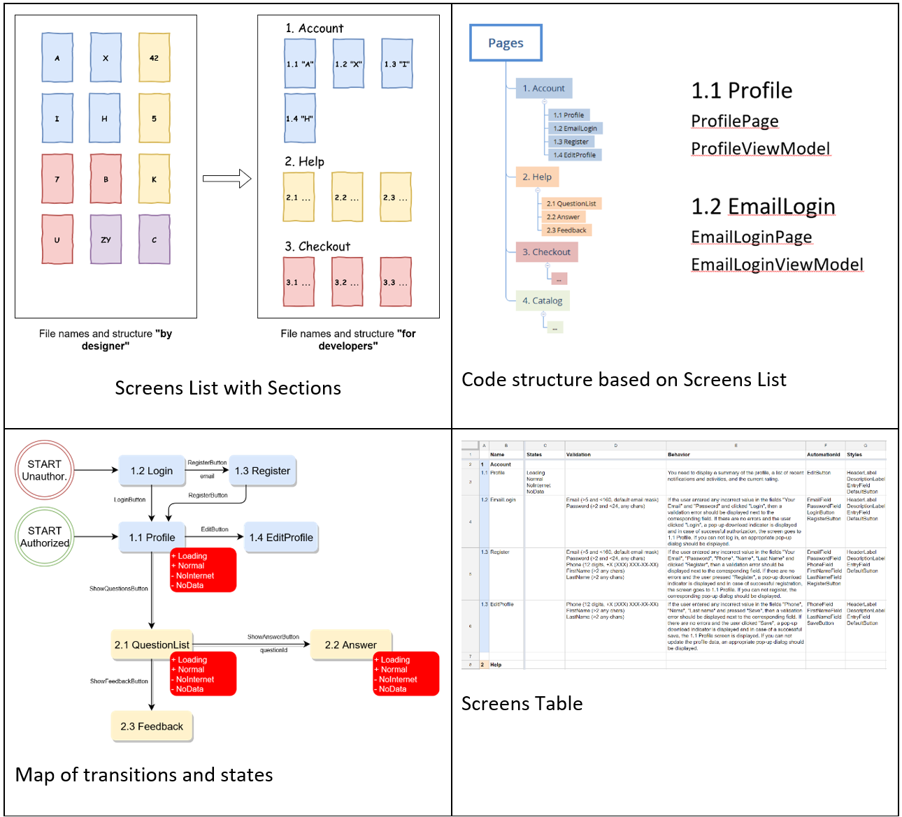

## 2. Working documentation and a common language

In order for DevOps to work and real interaction to exist between the teams, a common language and a centralized documentation, which is clear  and available to all participants, is needed. Here, no approach gives clear guidelines, after-all, the systems are all different. However, the documentation goes through the full life cycle of the project and is a tool for communication and team interaction.

Figure 1. Working documentation

Competent working documentation is able to simplify and accelerate the development of the project. We will describe this process in more details with our upcoming guide ["Software Design of Mobile Applications"](https://books.binwell.com/software-design-of-mobile-applications/).

Here we will indicate the main documents (see Figure 1):

- list of screens;
- map of transitions and states;
- table of screens.

It is important to use end-to-end naming and numbering in these documents. This is what simplifies and speeds up the process of communication within the team. Another important factor is the compliance of documentation and code, which makes communication between business and developers clear.   

