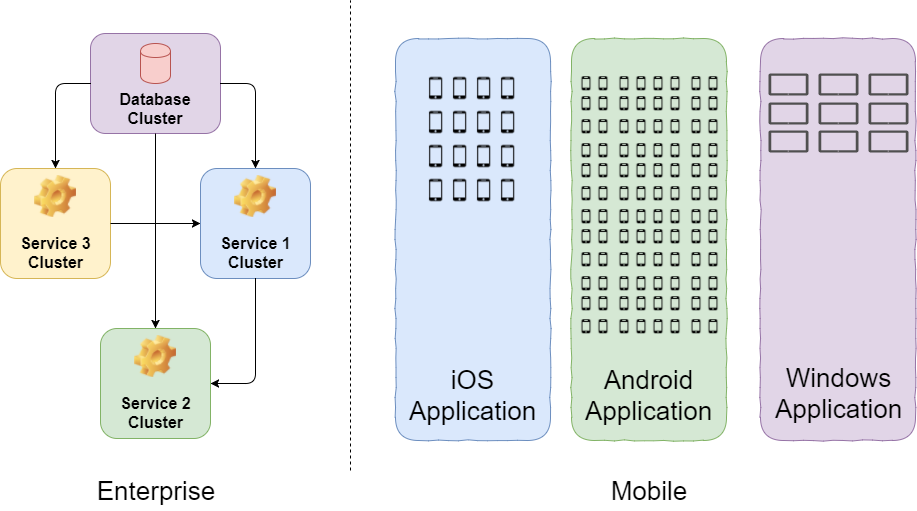

# 3. Enterprise CI/CD vs Mobile CI/CD

By itself, DevOps emerged as an approach for large teams and companies working on large IT systems, consisting of many parts, often written in different programming languages, and designed for different execution environments. However, as the term and approach were popularized, DevOps began to adapt to various teams to solve a wide range of problems. 

Most often DevOps is associated with large digital products, developed and maintained by dozens, hundreds, and sometimes thousands of specialists. Many teams have already developed their own practices and tools to support the DevOps process - the systems of automatic building, testing, deployment and monitoring. Usually this is all created on its own infrastructure, but cloud CI/CD tools are also actively being developed.     

Figure 2. The difference between Mobile CI/CD and Enterprise CI/CD

Mobile CI/CD is a "smaller" version of the Enterprise CI/CD, since mobile applications are primarily a user interface for interacting with external IT systems. Mobile teams tend to have a much smaller scale. Also, Mobile development has its own unique challenges:

- multiple platforms;
- different devices.   
  
You can find the high-level difference between Mobile and Enterprise applications on Figure 2. We’ll talk about these specifics a little bit later. 
