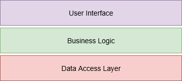
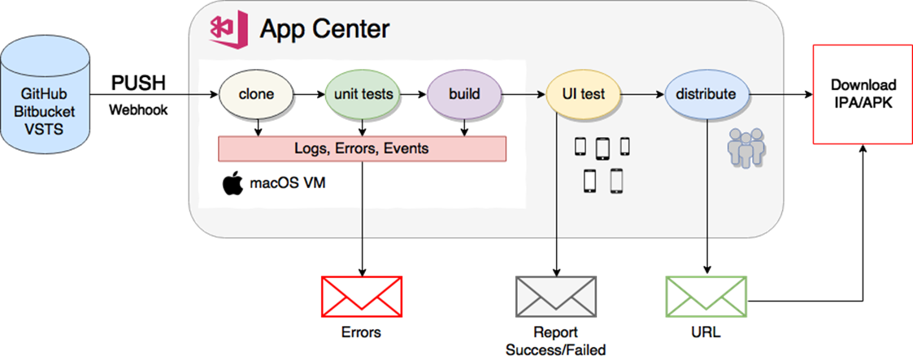
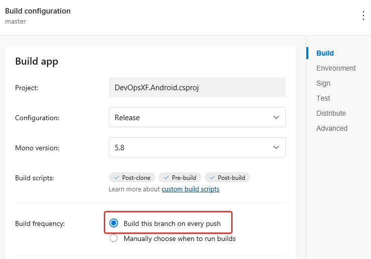
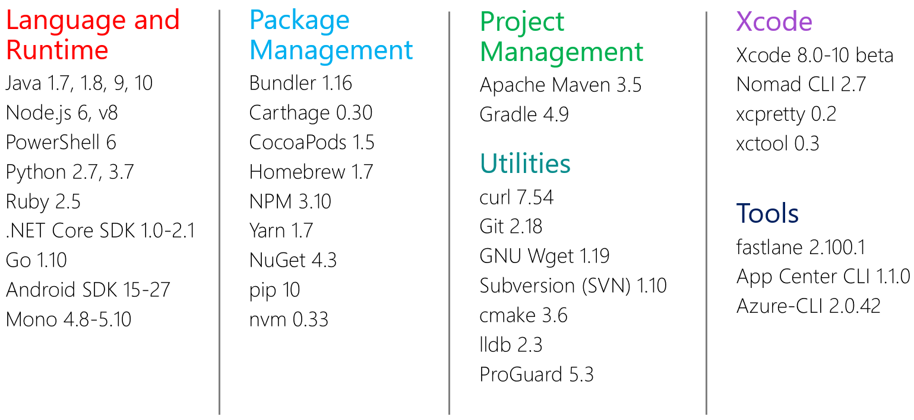
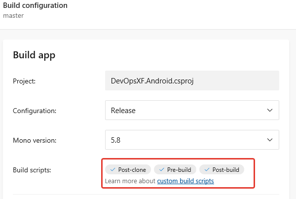
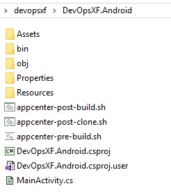
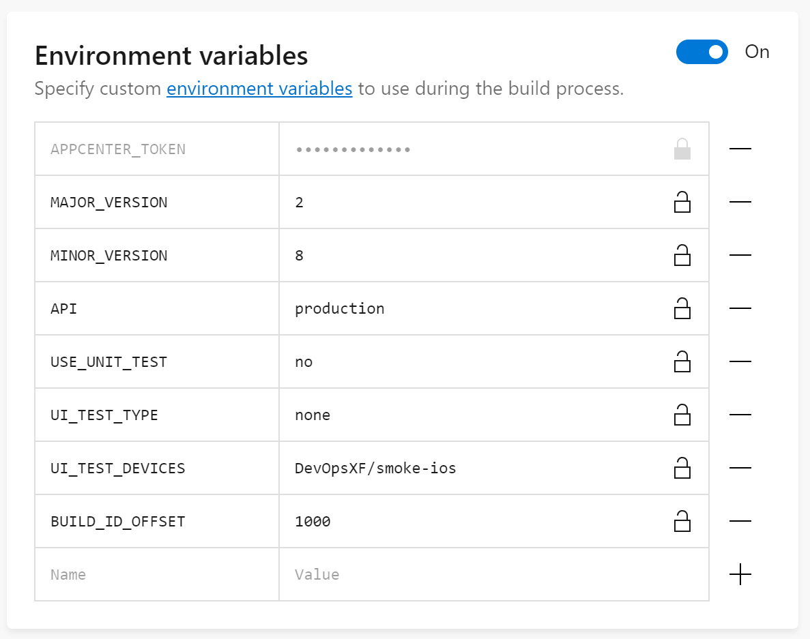

# 4. Mobile CI/CD pipeline

After touching on the culture of interaction and working documentation, we can now proceed to the tools for building a CI/CD pipeline. The more operations you can automate, the better.
Mobile development has 3 distinct problem areas:

* Different operating systems and their versions. The application should work correctly on a wide range of operation systems, each of which has its own features and limitations.
* Different CPU architectures. The smartphones and tablets themselves are constantly improving, but we should not forget about the older devices produced five years ago, which can still be in use by the actual users.
* Different screen resolutions of devices. Regardless of the number of pixels or aspect ratio, the mobile application interface should be correctly displayed on all devices.
In general, testing and debugging on a large sample of real devices is strictly necessary. 

In real projects manual testing on smartphones or tablets is mandatory. However, part of the code can be easily covered by automatic tests based on Unit Testing tools. Let's look at the typical architecture of mobile application - see Figure 3.

Figure 3. Classical three-tier architecture

Full tests coverage is more reasonable to carry out in 2 directions:

* unit-tests \(functional, integration\) for a Data Access Layer \(or Repositories\).
* UI-tests \(functional, regression\) for Business Logic and User Interface layers.

Covering all layers of mobile application with unit-tests is not possible, and it also reduces the speed of development. For the automatic unit-testing phase within the CI/CD-pipeline, it will be useful to cover the following mechanisms of the DAL layer:

* methods for accessing the Backend API;
* methods of access to data \(Repositories\);

If we talk about automatic UI tests, then you can test the following:

* performance of the application on real devices with the right characteristics;
* the ability to execute key business scenarios.

Based on the UI tests results, screenshots are made for each step on each device. A QA engineer, in manual mode, can then view the correctness of the application's layout at different resolutions and screen sizes.
Usability, animations and other user characteristics are difficult to check with UI tests, they are best left to live testers and beta users. More details on UI-testing, will be covered in next chapter.

### 4.1 Mobile CI/CD with App Center

Toolkits for building and publishing installation packages has been around for a long time. Typically, this is a set of scripts that was used on the build machine in the mobile development team. Recently, however, cloud services have started to gain popularity for the implementation of CI/CD. In our articles, we will focus on the Visual Studio App Center, which is a universal tool that includes a full set of necessary DevOps services: building, testing, distribution and monitoring. Figure 4 shows the general process of Mobile CI/CD.

Figure 4. Automated Mobile CI/CD pipeline

### 4.2 Build Tools

You can run the CI/CD-pipeline either independently by the Slack command, or automatically for every Push to the repository. With the cloud CI/CD it is better to configure the automatic option, this will shorten the way of receiving information about errors. Below are the necessary settings for the build pipeline in App Center \(add the project in App Center, connect the code repository and configure Build for different branches - see Figure 5\).

Figure 5. Pipeline settings for automatic build


Manual mode is best left for more complex scenarios - for example, preparing a separate assembly for A/B testing. Or running a wider set of functional tests before delivery to beta users.

In order to realize the possibility to run your autotests in App Center, you need to write bash-scripts for iOS/Android and put them in the project folder:

* **appcenter-post-clone.sh** - starts right after the remote repository is cloned on the build-machine \(mac for iOS/Android\). You can run unit tests here;
* **appcenter-pre-build.sh** - it is executed before the application build, here it is possible, for example, to write BUILD_ID in the application version \(x.y.BUILD_ID\);
* **appcenter-post-build.sh** - starts immediately after the successful building of the application. At this step, you can run _custom_ Smoke tests on real smartphones/tablets or advanced Acceptance or tests.

Since the building \(including packaging and signing\) of actual mobile applications takes quite a long time (more than 5-10 minutes), you can run unit-tests on post-clone or pre-build steps, this will allow quick diagnostics of key mechanisms. But Smoke testing, which is highly recommended in mobile development, should be done after the build. This will verify that the application, at least, will run on real smartphones with the required OS versions.

In order to build applications in the App Center, virtual Macs working on Apple hardware are used. These machines have a rich set of tools that you can also use in your bash scripts - see Figure 6.

Figure 6. Tools pre-installed on the macOS in the App Center

And then we'll look at the scripts themselves.

### 4.3 Custom scripts for build steps
If you have not written shell scripts for bash, then you need to practice a little and read the documentation: [bing.com/search?q=bash+for+beginners](https://bing.com/search?q=bash+for+beginners)

In our example, we created an automatic CI/CD pipeline for the master branch in the repository on GitHub.

Figure 7. Automatic search for additional build scripts

As you can see in Figure 6, App Center automatically found our scripts that were added to the project folder (where the .xcodeproj, build.gradle, .csproj, .sln or package.json files are located).

 Figure 8. Scripts appcenter- * in the project folder

When writing scripts, it may be necessary to use bash environment variables - an external script or the program writes its variable to the bash session, for example *APPCENTER_SOURCE_DIRECTORY* and this allows to use the value of this variable in your scripts. Key pre-defined environment variables in App Center:

|          Variable          | Desription                                                                                                                                                 |
|:--------------------------:|------------------------------------------------------------------------------------------------------------------------------------------------------------|
|     APPCENTER_BUILD_ID     | Build number - increases by 1 for each build start                                                                                                         |
|      APPCENTER_BRANCH      | The repository branch from which to run the build                                                                                                          |
| APPCENTER_OUTPUT_DIRECTORY | The folder in which the build results will be stored - IPA/APK packages, other binary files                                                                |
|      APPCENTER_TRIGGER     | How the build script was started - manually on the App Center web site \("manual" value\) or automatically when pushing into the repository \("continuous"\)   |

Read more: [docs.microsoft.com/en-us/appcenter/build/custom/variables](https://docs.microsoft.com/en-us/appcenter/build/custom/variables)

You can also configure your environment variables in the build parameters (see Figure 9).

Figure 9. Customizing your environment variables for build pipeline

In your scripts, you can use the variables **\$MAJOR_VERSION** and **\$MINOR_VERSION**, as shown in the example for appcenter-pre-build.sh. In your scripts you can also modify your application source code with regular expressions and shell tools/commands. 

Now let's look at each script separately. We'll start with the post-clone step, which will start Unit-tests. All examples are provided for Xamarin based Android project.

**appcenter-post-clone.sh**

```

#!/usr/bin/env bash -e

echo "Found Unit test projects:"
find $APPCENTER_SOURCE_DIRECTORY -regex '.*UnitTests.*\.csproj' -exec echo {} \;
echo
echo "Run Unit test projects:"
find $APPCENTER_SOURCE_DIRECTORY -regex '.*UnitTests.*\.csproj' | xargs dotnet test;

```

As you can see, the script searches for folders with .csproj-files \(Visual Studio projects\), the name of which contains UnitTests and runs unit-tests based on NUnit or MSTest. In our example, unit-tests are implemented on with .NET Core and MSTest. You can use any familiar tools for unit-testing, depending on the framework which you will use to develop application.

**appcenter-pre-build.sh**

```

#!/usr/bin/env bash -e

MANIFEST="$APPCENTER_SOURCE_DIRECTORY/DevOpsXF.Android/Properties/AndroidManifest.xml"
NEW_VERSION=${MAJOR_VERSION}.${MINOR_VERSION}.${APPCENTER_BUILD_ID}

sed -i -e "s/versionName=\".*\"/versionName=\"${NEW_VERSION}\"/g" $MANIFEST


```

In this step, you can add BUILD_ID to the version of the application in the format **MAJOR_VERSION.MINOR_VERSION.BUILD_ID**. We can also perform any additional actions here before the build.


**appcenter-post-build.sh**

```

#!/usr/bin/env bash -e

uiTestProjectName="DevOpsXF.UITests"
appFileName="com.binwell.DevOpsXF.apk"
locale="ru_RU"

if [ "$APPCENTER_BRANCH" == "master" ];
then
	msbuild $APPCENTER_SOURCE_DIRECTORY/$uiTestProjectName/ /p:Configuration=Release	
	appcenter test run uitest --app $appName --devices "slavachernikoff/Smoke" --test-series "Smoke" --include-category "Smoke" \
	--app-path $APPCENTER_OUTPUT_DIRECTORY/$appFileName --locale $locale --build-dir $APPCENTER_SOURCE_DIRECTORY/$uiTestProjectName/bin/Release \
	--token $APPCENTER_TOKEN 
fi

```

If the build has reached this step, then you have APK/IPA installation package. For many teams, the CI/CD pipeline was interrupted at this step, as it was required to check on actual devices, and on-premise device farms for UI-tests was a luxury. In provided script uses the App Center Test Cloud for automatic custom Smoke tests \(based on Xamarin.UITest\) to run the application. 